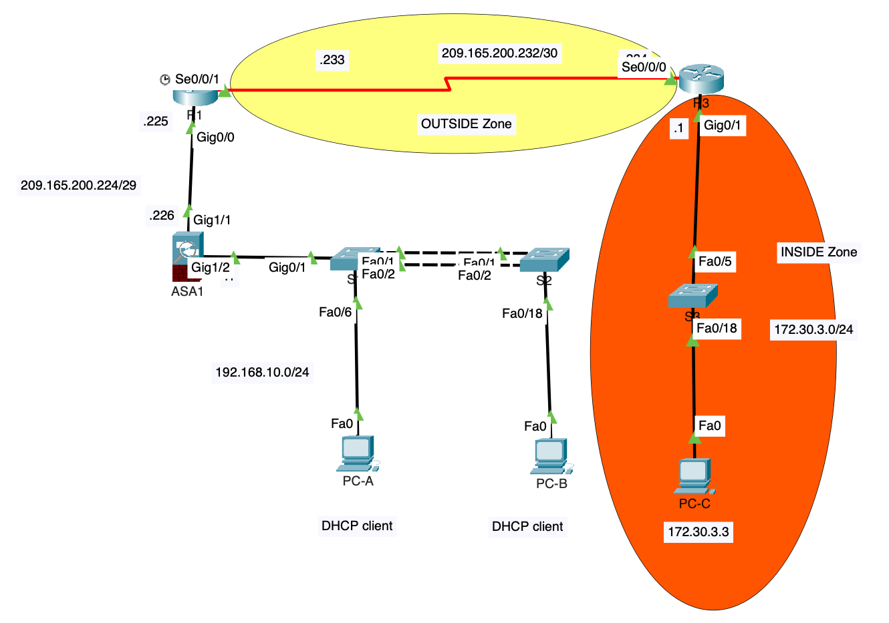

# Cisco Enterprise Network Security Lab

## Overview

This project demonstrates the design, configuration and security hardening of a simulated enterprise network using Cisco routers, switches and an ASA firewall.

The lab focuses on practical routing, switching, firewall configuration, secure device management and Layer 2 network security. It also includes troubleshooting and verification of network connectivity and security policies.

The environment was built and tested in Cisco Packet Tracer.

## Technologies and Skills

- Cisco IOS
- Cisco ASA
- Cisco Packet Tracer
- TCP/IP
- VLANs and trunking
- AAA authentication
- SSH v2
- Zone-Based Firewall
- NAT
- DHCP
- IOS IPS
- Port Security
- DHCP Snooping
- BPDU Guard
- Syslog
- NTP
- Network troubleshooting

## Network Topology



The diagram shows the lab topology. Connectivity and security verification screenshots can be added separately.

The simulated network contains Cisco routers, switches and an ASA firewall representing internal and external network segments.

The design applies network segmentation and security controls at multiple layers, including router security, switch security and perimeter firewall protection.

## Router Security

The router configuration includes secure management and traffic-control mechanisms.

Key configurations include:

- Local AAA authentication
- SSH version 2 for secure remote management
- Restricted VTY access
- Zone-Based Firewall
- Static/default routing
- Remote logging
- Authenticated NTP
- IOS IPS

### Example: Zone-Based Firewall

The internal and external interfaces were assigned to separate security zones.

Traffic between the private and public networks is inspected through a Zone-Based Firewall policy.

The firewall configuration follows the structure:

```text
Private zone -> Zone pair with inspection policy -> Public zone
                         |
                         v
                  Policy map (inspect)
                         |
                         v
                  Class map (TCP, UDP, ICMP)
```

This allows selected traffic such as TCP, UDP and ICMP to be inspected while maintaining separation between trusted and untrusted network areas.

## Switch Security

Layer 2 security controls were implemented to reduce common access-layer risks.

The configuration includes:

- VLAN segmentation
- Trunk configuration
- Port Security
- Sticky MAC address learning
- PortFast
- BPDU Guard
- DHCP Snooping
- Disabling unused switch ports

Port Security was used to restrict the number of MAC addresses allowed on access ports.

Sticky MAC learning was configured to learn and retain MAC addresses on access ports, subject to the configured address limit.

BPDU Guard was enabled on edge ports to protect the spanning-tree topology from unauthorised switches.

## ASA Firewall

The Cisco ASA firewall was configured as the perimeter security device.

The firewall separates the internal network from the external network using different security levels.

### Inside Interface

- Security level: 100
- Internal subnet
- DHCP service enabled

### Outside Interface

- Lower security level
- External network connectivity
- Default route configured

### Security Features

The ASA configuration includes:

- Inside/outside interfaces and security levels
- Dynamic NAT/PAT
- DHCP
- SSH management
- Default routing
- ICMP inspection

Dynamic PAT allows internal hosts to share the ASA outside interface address when accessing external networks.

## Network Services

### DHCP

DHCP was configured to automatically assign IP addresses to internal hosts.

### NTP

Authenticated NTP was configured to maintain consistent system time across network devices.

### Syslog

Remote logging was configured to send router events to a central logging server.

These services support network monitoring, troubleshooting and operational consistency.

## Security Architecture

The project applies security controls across multiple network layers:

| Layer | Security Controls |
|------|-------------------|
| Device Management | AAA, SSH v2 |
| Layer 2 | VLANs, Port Security, BPDU Guard, DHCP Snooping |
| Layer 3 | Routing, Zone-Based Firewall |
| Perimeter | Cisco ASA, NAT, traffic inspection |
| Monitoring | Syslog, NTP |
| Threat Protection | IOS IPS |

## Troubleshooting

During the lab, configurations were verified and network issues were diagnosed using Cisco CLI commands and connectivity tests.

Troubleshooting focused on:

- Interface status
- IP addressing
- Routing
- SSH access
- Firewall policies
- NAT
- DHCP
- Switch port security
- End-to-end connectivity

Useful verification commands include:

```text
show ip interface brief
show ip route
show running-config
show access-lists
show zone security
show zone-pair security
show policy-map type inspect zone-pair
show port-security
show port-security interface <interface-id>
show ip dhcp snooping
ping
traceroute
```

## Configuration and Verification Scenarios

The following scenarios describe the implemented security controls and the checks used to validate them. They are configuration walkthroughs; detailed incident records and captured test results can be added separately.

### Scenario 1 — Secure Remote Access

**Problem**

Remote administrative access to the router needed to be secured.

**Approach**

The device management configuration was reviewed, including local authentication, SSH settings and VTY configuration.

**Solution**

AAA local authentication and SSH version 2 were configured and applied to the VTY lines.

**Verification checks**

Test remote management through SSH and confirm that VTY access permits SSH only.

---

### Scenario 2 — Internal-to-External Traffic Control

**Problem**

Traffic between the trusted internal network and the external network required controlled access.

**Approach**

The router interfaces were assigned to private and public security zones.

A class map was created to identify TCP, UDP and ICMP traffic.

**Solution**

A Zone-Based Firewall policy was applied to the zone pair between the private and public zones.

**Verification checks**

Test permitted TCP, UDP and ICMP traffic and inspect the zone-pair policy to confirm that the intended inspection rules are applied.

---

### Scenario 3 — Switch Access Security

**Problem**

Access-layer switch ports required protection against unauthorised devices and Layer 2 attacks.

**Approach**

Access ports were hardened using port security and spanning-tree protection.

**Solution**

Sticky MAC learning, MAC address limits, PortFast and BPDU Guard were configured.

**Verification checks**

Review port-security status, learned MAC addresses and interface status using Cisco show commands.

---

### Scenario 4 — ASA Internet Access

**Problem**

Internal hosts required access to the external network while remaining behind the ASA firewall.

**Approach**

The ASA inside/outside interfaces, routing and address translation configuration were reviewed.

**Solution**

Dynamic NAT/PAT was configured for the internal network and a default route was added through the outside interface.

ICMP inspection was also enabled for connectivity testing.

**Verification checks**

Test internal-to-external connectivity and review address translation, routing and ICMP inspection on the ASA.

## What I Learned

This project strengthened my practical understanding of:

- Cisco router, switch and firewall configuration
- Network segmentation
- Secure remote device management
- Firewall policy design
- Layer 2 security
- NAT and DHCP
- Network monitoring
- Systematic network troubleshooting

The project also improved my ability to analyse network problems, identify configuration issues and apply appropriate security controls.

## Repository Contents

- [Network topology](topology/network-topology.png)
- [R3 router configuration](configs/R3-running-config.txt)
- [S2 switch configuration](configs/S2-running-config.txt)
- [ASA1 firewall configuration](configs/ASA1-running-config.txt)
- [Configuration notes](configs/README.md)

```text
Cisco-Enterprise-Network-Security-Lab/
├── README.md
├── topology/
│   └── network-topology.png
└── configs/
    ├── README.md
    ├── R3-running-config.txt
    ├── S2-running-config.txt
    └── ASA1-running-config.txt
```

The published configurations cover three devices, not every device shown in the topology. The wider lab scope described above is not fully evidenced by these three exports. Verification screenshots and detailed troubleshooting records can be added separately.

## Disclaimer

This project was completed in a simulated academic lab environment using Cisco Packet Tracer.

The published text files are sanitised: account names, credentials, secret hashes, NTP authentication keys, device serial identifiers and learned MAC addresses have been replaced or removed. The domain name is a generic placeholder. Lab IP addresses and routing/security policies are retained to explain the topology. Replace redaction placeholders before using these exports in a lab.

